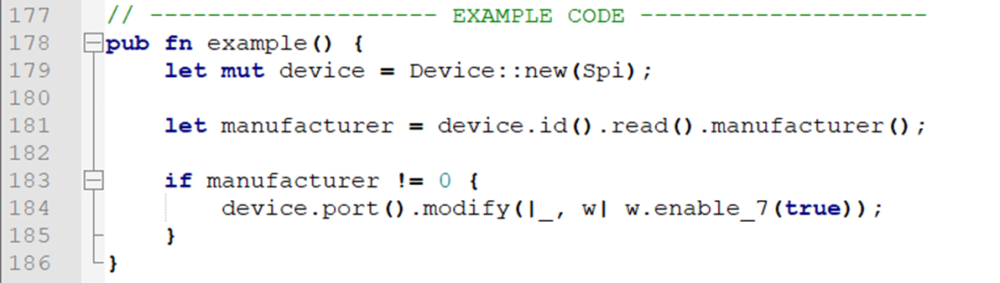
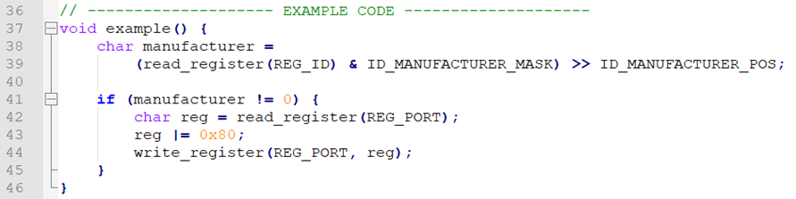

<div class="read">

# A fancy low level driver in Rust

*Note: This chapter is more opinionated than most, you might disagree with some of what's written here*

Everything in computers is a number. Strings are numbers, pointers are numbers and all values are numbers.
But we don't program our computers like that anymore. The time that we wrote everything in assembly are long gone.

In programming languages we create types to represent our data. This helps us avoid mistakes because the compiler can do
checks for us.

If we've changed our ways in programming, then why would we be satisfied by programming our devices with just numbers?
Every register represents a different type, so let's try to model it that way.

A good example is the [`DW1000`](https://crates.io/crates/dw1000) crate:

```rust
self.ll.pmsc_ctrl0().modify(|_, w| {
    w
    .gpdce((enable_rx_ok || enable_sfd || enable_rx || enable_tx) as u8)
    .khzclken((enable_rx_ok || enable_sfd || enable_rx || enable_tx) as u8)
})?;
```
*[`source`](https://github.com/braun-embedded/rust-dw1000/blob/d25c1b7f711fdb41c3d99da582571690bd67f2d8/dw1000/src/hl/ready.rs#L430)*

If we apply and compare this same style to the example code of the previous chapter, we get the following:



Versus the C & simple rust implementation:



The fancy rust implementation requires no masking, bit shifting and every field can be typed as we want while generating
the exact same assembly.
To learn more about how such a driver can be built, I did a talk about that online: [youtube](https://youtu.be/z9z74VpqO9A) & [driver code](https://gist.github.com/diondokter/66cd38125178be78c40e8e08ee722d91)

*The images here were borrowed from that talk.*

Writing a driver like this is a lot of work, so to aid with that there's a crate that can generate this for us: [device-driver](https://crates.io/crates/device-driver)

</div>
