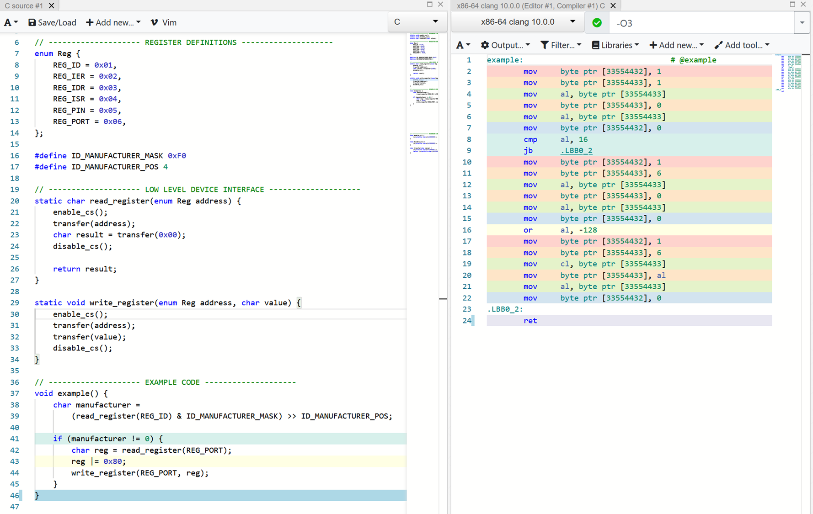
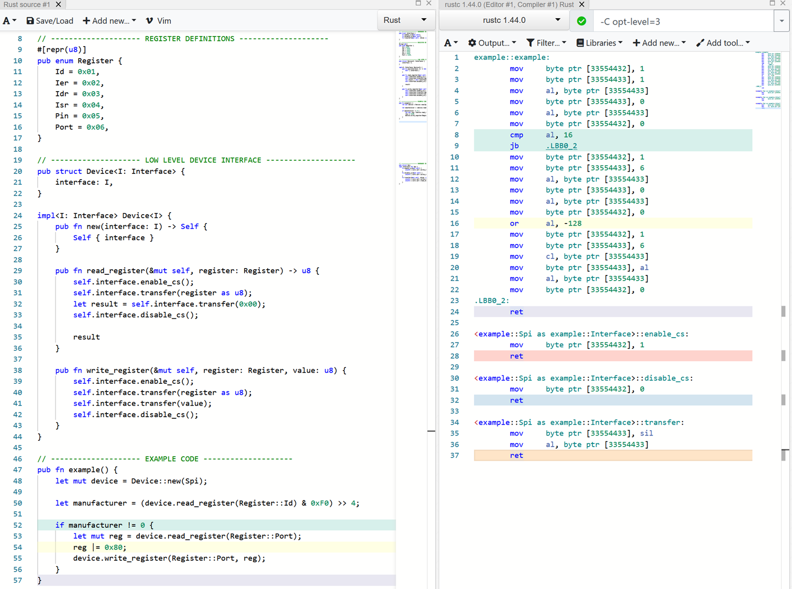

# Low level driver

We'll imagine we have some sort of gpio expander over spi.
We create a function for reading and a function for writing to registers.
To know which registers we can talk to, we'll define all registers and their addresses.

To read specific fields in the registers, we can create some masks and position constants.

To test out how well this works to write the code for, we'll have another example function.
It will read the manufacturer field. Then if the manufacturer is not `0`, then we set the highest bit in the port register.

## Done in C

To define the registers we'll use an enum and some `#define`s to make the mask and position constant.

If we look at the assembly, then we can see that the performance should be fantastic.
We only move data, do a compare and possible jump because of the if statement and do an `or` because we set the bit.
This couldn't have been done in fewer instructions.

## Done in Rust

In Rust we can do a very similar setup, let's see what it can look like.

As we can see, the code ends up looking very similar and the generated assembly is identical.

This is great, but there are a lot of pitfalls.
It is really easy to make a mistake here. We could shift bits with the wrong amount, use the wrong mask or even the wrong register.
Nothing except for manual testing (unless you've got a testing rig hooked up to a CI) will save us from these mistakes.

We can do a lot better in Rust and make our driver work like the PACs.
In the interest of time we will not go over how they can be made exactly.
Instead we can look at the possibilities in the next chapter.

