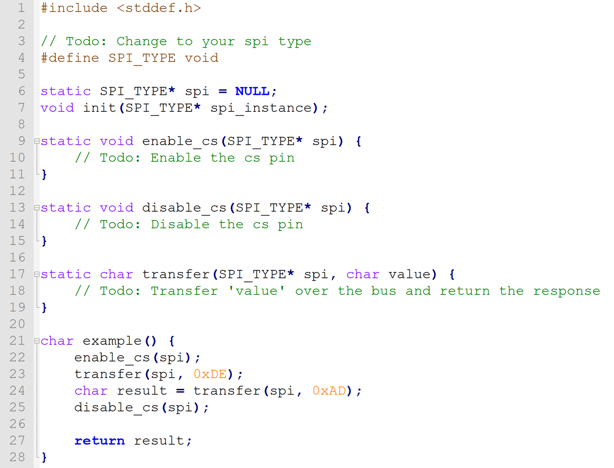
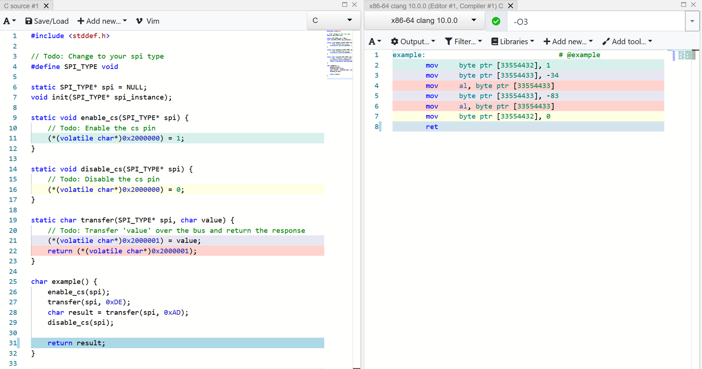
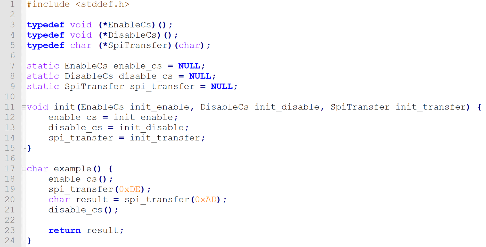
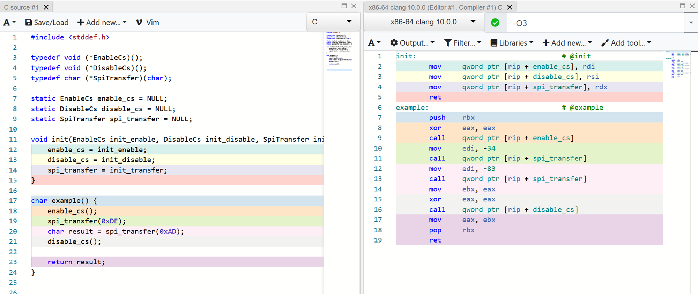
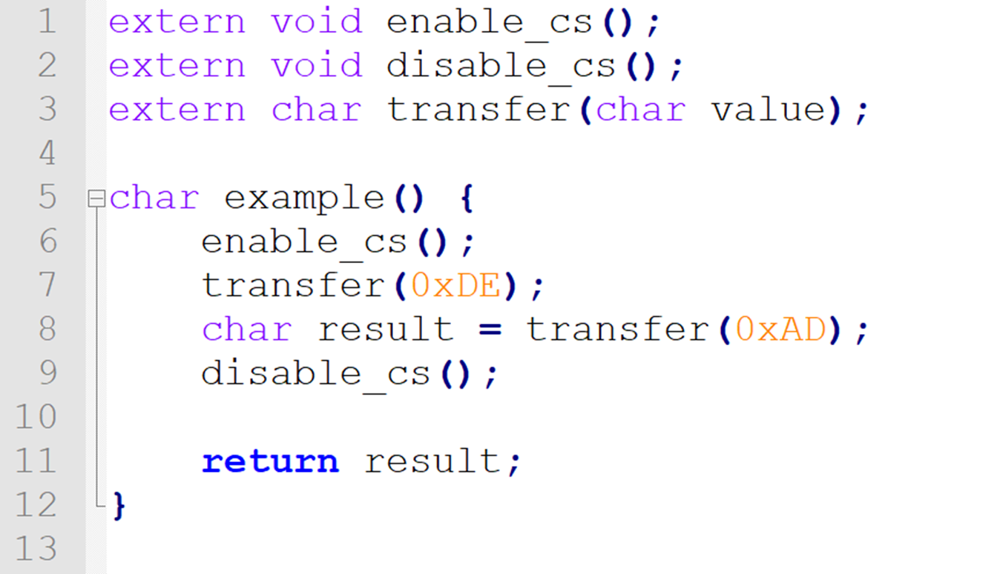
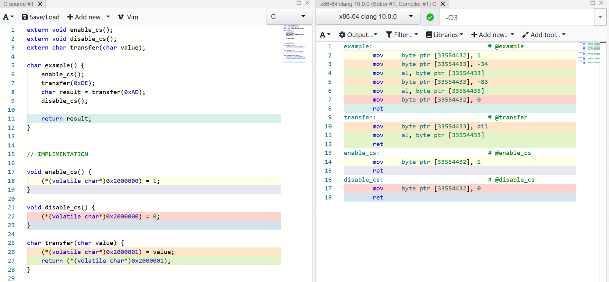

# Abstraction in C

C as a language does not have explicit built-in machinery for abstractions.
If you try to google for it you only get results back for C++, Java and C#.

C++ does have abstraction functionality, but since C is so dominant in the field, most people writing a device driver
restrict themselves to the C subset.

So that's what we're going to do today too.

For drivers there are generally three ways to abstract the hardware.
We want to abstract the hardware to make the driver compatible with many devices instead of just one.

## 1. Fill-in functions

This first variant wants you to copy the driver in your source or make a fork for your setup and customize existing functions.
It can look something like this:

This example needs three functions to use the SPI bus.
- The chipselect must be enabled
- The chipselect must be disabled
- The transfer must be done

The users of this library is expected to fill in these functions for their setup.
This is not very optimal for code reuse. If you have multiple drivers, then you must reimplement this functionality for
all of them.
One of the upsides for this approach is the performance and code size.
Since these are just normal functions they can be maximally optimized.

We can check that by looking at the generated assembly in godbolt.

As you can see, the functions only write and read from some pointers to simulate the registers.
The compiler reflects this by only emitting `mov` instructions. This means that aside from doing the reads and writes,
we're not doing anything else. The overhead is zero and thus this is the best result we can get.

So the performance is good, but the usibility is bad. What more is there?

## 2. Function pointers

We can abstract the function itself. The users can then tell us what to call by giving us the pointers to their functions.

Here we can see that the user is expected to call the init function to set up the function pointers.

This is pretty nice from a usability perspective.
The library doesn't have to be cloned/adapted and can still be built on its own for things like automated tests.
But how does the performance stack up?

Compared to the previous one, this isn't very good.

We have a small overhead for the init function and the storage of the pointer, but this isn't the problem.
Because we added a layer of indirection, we can't inline all the function calls.
Instead of only `mov` instructions we see that the pointers actually need to be `call`ed and also need to do the full ritual that any function call requires.
This is the case for the function that is being called as well.
When performance is tight, for example when pushing pixels to a screen, this overhead can easily slow us down by a magnitude.

Can we get good performance ***and*** decouple the implementation from the library?

Yes, but...

## 3. Link-time binding

We can rely more on the linker. This is the last step of the compilation chain.

Instead of having the function or a pointer to it in our code, we can simply tell the compiler that the function we need is *somewhere out there* using the `extern` keyword.

We can simply call the functions and it's up to the linker to figure out where that function is located.
Because the linker does figure it out in the end which functions we are calling, it can optimize our calls.
This leads to the good performance we want.

Because the function are externally available, they end  up in our assembled output.
But the example function doesn't call them because they were nicely inlined.
There are only `mov` instructions, so we have the best outcome.

However, sadly pretty much all the linkers we use have an atrocious user experience.
When something goes wrong with this approach, like when it can't find a function or when it was found,
but has the wrong signature, we can get really bad errors.

## Conclusion

All of these approaches have significant downsides.
In the next chapter we'll find out how Rust solves this issue.

